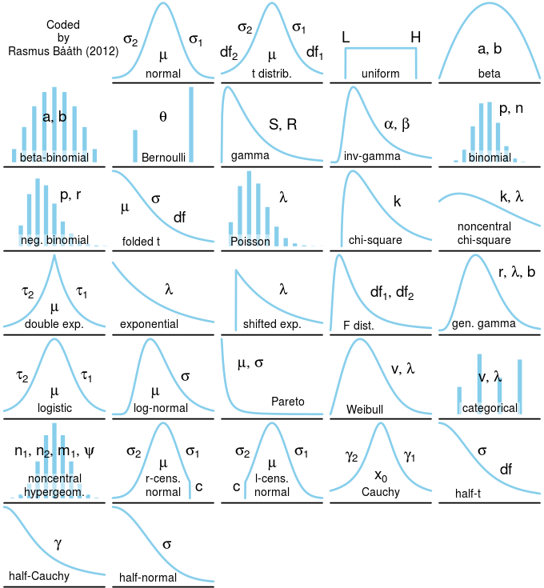

# Linear mixed models  

September 9th 

## Announcements 

- [**HW 2**](https://stat870.github.io/fall2026/assignments/Assignment2_YourLastName.pdf) is up and due next Wednesday 
- In-class review 

## Statistical modeling 

- Statistical models combine deterministic (see step 1 below) and stochastic (see step 2 below) components 


### Three steps to modeling data 

1. Define the linear predictor $\boldsymbol\eta = \mathbf{X}\boldsymbol{\beta} + \mathbf{Z}\mathbf{u}$, 
2. Define the probability distribution for the data, $\mathbf{y}|\mathbf{u}$, 
3. Define the link function $g(\cdot)$, $\boldsymbol\eta = g(\mathbf{y}|\mathbf{u})$. 


```{r echo=FALSE, fig.cap="Common variable distributions. Page 60 in Stroup et al. (2024)", out.width = '80%', fig.align='center'}
knitr::include_graphics("../figures/stroup_distributions.jpg")
```

```{r echo=FALSE, fig.cap="Common variable distributions.", out.width = '80%', fig.align='center'}

```


## Estimation of variance components 

For any unknown parameter, there are multiple ways to estimate it. We call those the methods of estimation.

### Maximum Likelihood Estimation (MLE)

**Maximum Likelihood Estimation** of variance components provides downward biased estimates for small data (most experimental data). 
$\ell_{ML}(\boldsymbol{\sigma; \boldsymbol{\beta}, \mathbf{y}}) = - (\frac{n}{2}) \log(2\pi)-(\frac{1}{2}) \log ( \vert \mathbf{V}(\boldsymbol\sigma) \vert ) - (\frac{1}{2}) (\mathbf{y}-\mathbf{X}\boldsymbol{\beta})^T[\mathbf{V}(\boldsymbol\sigma)]^{-1}(\mathbf{y}-\mathbf{X}\boldsymbol{\beta})$  

### Restricted Maximum Likelihood (REML)

**Restricted Maximum Likelihood** (REML) avoids MLE's downward bias under small data and is thus is the default in most mixed effects models. 

- In REML, the likelihood is maximized **after** accounting for the model’s fixed effects.  
- In REML, $\ell_{REML}(\boldsymbol{\sigma};\mathbf{y}) = - (\frac{n-p}{2}) \log (2\pi) - (\frac{1}{2}) \log ( \vert \mathbf{V}(\boldsymbol\sigma) \vert ) - (\frac{1}{2})log \left(  \vert \mathbf{X}^T[\mathbf{V}(\boldsymbol\sigma)]^{-1}\mathbf{X} \vert \right) - (\frac{1}{2})\mathbf{r}[\mathbf{V}(\boldsymbol\sigma)]^{-1}\mathbf{r}$, 
where $p = rank(\mathbf{X})$, $\mathbf{r} = \mathbf{y}-\mathbf{X}\hat{\boldsymbol{\beta}}_{ML}$.  
  - Start with initial values for $\boldsymbol{\sigma}$, $\tilde{\boldsymbol{\sigma}}$.  
  - Compute $\mathbf{G}(\tilde{\boldsymbol{\sigma}})$ and $\mathbf{R}(\tilde{\boldsymbol{\sigma}})$.  
  - Obtain $\boldsymbol{\beta}$ and $\mathbf{b}$.   
  - Update $\tilde{\boldsymbol{\sigma}}$.  
  - Repeat until convergence.  
- Variance components may be $<0$; in that case they are set to zero. 

### Method of moments (MoM)

**Method of moments** (MoM) is derived from ANOVA tables that include the expected mean squares. 

- Use actual sums of squares and expected mean squares (EMS) from ANOVA to clear for the different variance components. 
- e.g., $\tilde{\sigma}^2_{w} = \frac{SSw - SS_e}{c}$ (See table above). However, if $\tilde{\sigma}^2_{w} < 0$, $\hat{\sigma}^2_{w} = 0$. 

- Issues with variance estimates equal to zero 
  - Type I error inflation 
  - [Frey et al. (2024)](https://acsess.onlinelibrary.wiley.com/doi/10.1002/agj2.21570) 


## Reading 

- Gelman and Hill (2006) Chapter 12 (multilevel modeling basics)
- Stroup et al. (2024) Chapter 6 (statistical inference)

